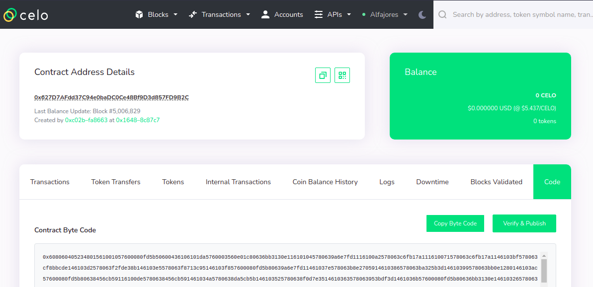
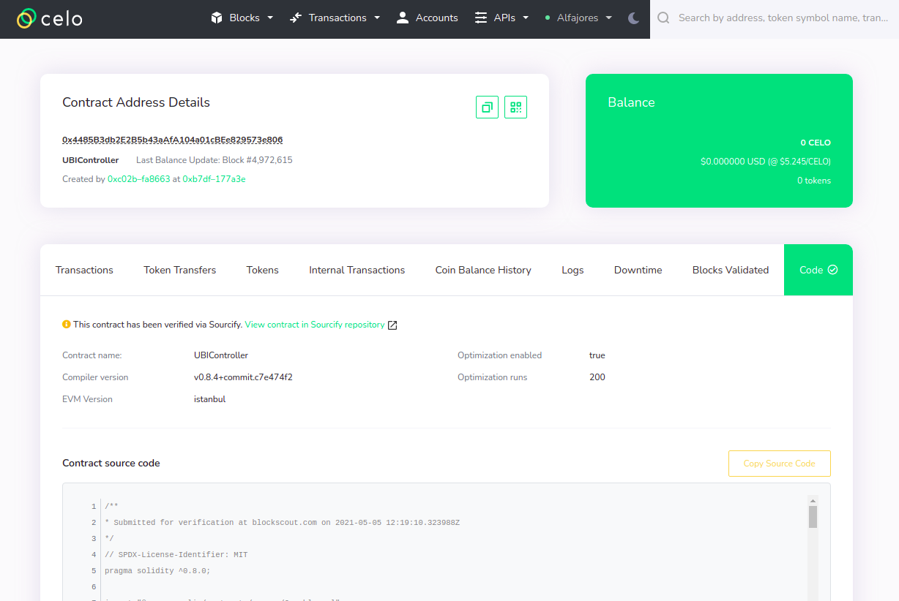
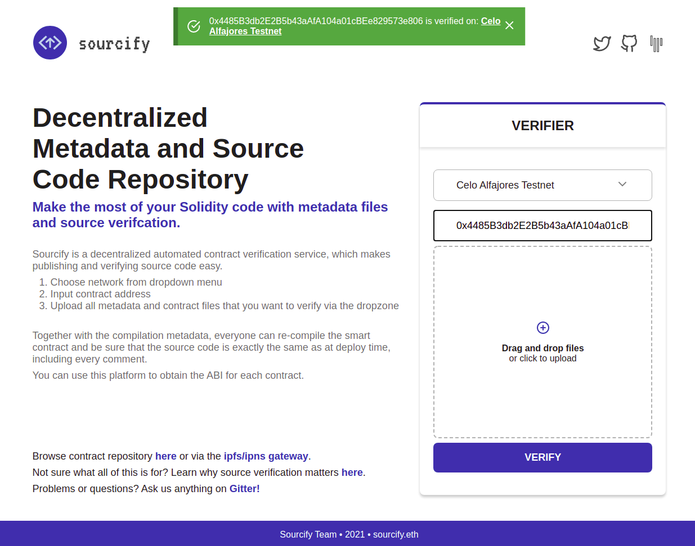
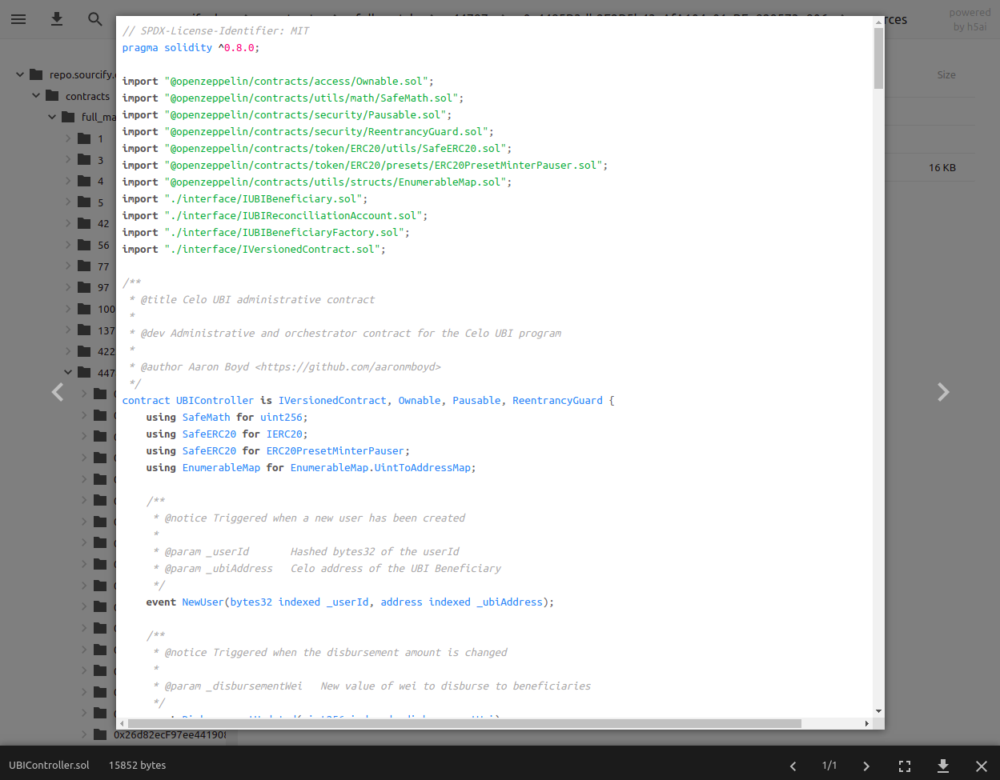

# Source Code Verification

Blockscout uses [Sourcify](https://sourcify.dev/) as the backend and driver for source code verification. We encourage you to read this FAQ which explains why verification is important: https://blog.soliditylang.org/2020/06/25/sourcify-faq/

# Instructions for the public

_Don't trust, verify!_

## Verify through Blockscout

The default page for any address link in Blockscout is the "Transactions" tab. If the address is a a smart contract, you can click to the "Code" tab. Here's an example of an _unverified_ smart contract with simply the deployed bytecode visible. There is a button to "Verify & Publish". Here's an example from: https://alfajores-blockscout.celo-testnet.org/address/0x627d7afdd37c94e0badc0ce48bf9d3d857fd9b2c/contracts



If the project has already gone through the verification steps, in addition to the deployed bytecode, the source code, compiler version, EVM version and links to the Sourcify repository will appear. The "Verify & Publish" button is now hidden. Here's an example from: https://alfajores-blockscout.celo-testnet.org/address/0x4485b3db2e2b5b43aafa104a01cbee829573e806/contracts



## Verify through Sourcify.dev

You may also skip the Blockscout page and go directly to Sourcify (https://sourcify.dev) and check for yourself. Select the network from the dropdown list, enter the address of the contract you want to verify



Follow the link in the result header, or just navigate to the Sourcify repository: https://repo.sourcify.dev/ and browse for the chainID under the `contracts/full_match` folder. In this example, the chainID is `44787` for the Celo Alfajores testnet. Example: https://repo.sourcify.dev/contracts/full_match/44787/0x4485B3db2E2B5b43aAfA104a01cBEe829573e806/sources/home/boyd/git/keyko/celo-ubi-contract/contracts/



## Does a verified contract mean it is safe to interact with?

## _No!_
Verification is simply a way of proving that a smart contract developer has deployed bytecode to a certain on-chain address that matches a _published_ and provably known source. Source code is stored on IPFS which can be retrieved by anyone manually even if Sourcify ceased to exist tomorrow.

Verification does not make any claims to the _function_, security, or fitness for any particular purpose of any smart contract. It is simply one piece of the decentralized security landscape. The public should inspect verified source code and check that it does what the project claims it should.

# Instructions for smart contract deployers

## General Requirements

* Verification requires the generated JSON artifact created during the build process (e.g. `/build/Contract.json`) _and_ the source Solidity file (e.g. `./contracts/Contract.sol`)
* However, if you set the `solc` metadata option `useLiteralSources`, you can skip providing the Solidity file and simply upload the JSON artifact, as the source code is already embedded in the build output file. 

A sample build configuration snippet for Celo (from `truffle-config.js`):
```
compilers: {
    solc: {
      version: "0.8.4",
      docker: false,
      settings: {          
       optimizer: {
         enabled: true,
         runs: 50
       },
       evmVersion: "istanbul",
       metadata: { useLiteralContent: true }
      }
    }
  }
```
## Publishing during migration

The easiest way is simply to bundle posting your source code directly to IPFS during the migration stage (example here using truffle) of deployment.

1. Add a script called `ipfs` to your `package.json` and call this command as you run migrations (example here using Alfajores):
```
  "scripts": {
    "ipfs": "node --no-warnings ./scripts/ipfs.js",
    "migrate:alfajores": "yarn build && yarn run ipfs && truffle migrate --network alfajores",
```
2. Create a `scripts` folder and the `ipfs.js` helper. 
    * You will need to add the dependencies `ipfs-http-client` and `shelljs` to your development environment. 
    * The IPFS client expects environment variables `INFURA_ID` and `INFURA_SECRET` to post the files to a remote IPFS server, so provide these via `dotenv` or directly to the environment. 
    * This pattern is adapted from https://github.com/cgewecke/metacoin-source-verify, so read the source there for further details.
```
#!/usr/bin/env node

const IPFS = require('ipfs-http-client');
const shell = require('shelljs');
const path = require('path');
const log = console.log;

const sleep = (ms) => {
    return new Promise(resolve => setTimeout(resolve, ms));
}

async function main(){
  const ipfs = IPFS({
    host:'ipfs.infura.io',
    port: '5001',
    protocol: 'https'
  });

  const artifactPaths = shell.ls('./build/contracts/*.json');

  log("Uploading sources & metadata to IPFS (Infura Gateway)...")
  log("========================================================")

  for (let _path of artifactPaths){
    const artifact = require(path.join(process.cwd(), _path));

    log();
    log(artifact.contractName);
    log("-".repeat(artifact.contractName.length));

    const res = await ipfs.add(artifact.metadata);
      log(`metadata: ${res.path}`);

    const res2 = await ipfs.add(artifact.source);
      log(`source:   ${res2.path}`);

    log(`Waiting 2 seconds before sending next file...`);
    await sleep(2000);
  }

  log();
  log('Finished.');
  log();
}

main()
  .then(() => process.exit(0))
  .catch(err => {
    console.log(err);
    process.exit(1)
  });
```
3. Celo (and testnets) have been added to Sourcify as a monitored EVM compatible source chain, and when you view the contract on Sourcify it should appear as already verified. However, to appear as verified on Blockscout (we need to at least once set a flag in the Blockscout database) you must upload the build metadata via the file uploader on Blockscout (see below).

_Note: an enhancement is planned so that you do not need to visit the Blockscout page and upload the JSON after posting to IPFS during the migration process. The enhancement will query the Sourcify API the first time anyone navigates to the address for the smart contract and update it in the backend automatically. This would mean you can add verification to your remote CI tooling like GitHub Actions or CircleCI without human intervention._ 

## Publishing via Blockscout

After navigating to your smart contract's address, the Code tab, and then the _Verify & Publish_ button, use the dropzone to add your build sources (either the JSON build artifact and optionally the original Solidity file).

Example below from https://alfajores-blockscout.celo-testnet.org/address/0x57f130e4873ac340cee867f64e4e203070984e9f/contract_verifications/new


After you click the _Verify & Publish_ button to post the files and the source is verified through Sourcify's API, you should be able to navigate to the contract's Code page again and see the now verified source code. Errors will appear in red in the dropzone.

## Publishing via Sourcify

Head to https://sourcify.dev, select the target network, enter the contract address, and drop the file(s) required. 

_Note: this approach will post the data to the Sourcify repository for the first time if it doesn't already exist, but Blockscout will not yet know that is it verified. You must publish through Blockscout as described above to have the contract verified in the Blockscout database permanently (there is currently no "scraper" process performing this automatically)_

## Troubleshooting

### Can I use `solc` or another compiler to generate _only_ metadata?

Yes. Remember that importing from `node_modules` is automatically remapped by many development environments, like truffle, so you must remap manually with `solc`.
```
solc @openzeppelin/=$PWD/node_modules/@openzeppelin/ \
    --metadata \
    --metadata-literal \
    -o ./build/metadata/ \ 
    contracts/MyContract.sol
```
This will create a `MyContract_meta.json` file in the output folder `./build/metadata/` which you can use exactly the same as if providing the full JSON build artifact.

### Why does my manually created metadata keeping failing when verifying?

The bytecode you deployed must exactly match the bytecode you regenerated manually. Often, there are discrepancies between the source file paths, especially among the different Solidity development tools, like Hardhat / Truffle. Any trivial difference will generate a different bytecode hash which means the file you try to upload will not match the deployed code.

For example, if you built and migrated with Truffle (which generates _absolute_ file paths for the source maps), and then regenerate the build artifacts from the exact same source files using `solc` (which generates _relative_ file paths, except after remapping node_modules), and attempt to verify with the `solc` generated metadata, it will fail.

There are a number of issues discussing this limitation and potential paths forward:

* https://github.com/ethereum/sourcify/issues/27
* https://github.com/ethereum/sourcify/issues/24

### Why is my _local_ directory structure now immortalised on a verified contract in Sourcify's repository?


See the previous comments about directory structure. You used a build tool that uses absolute paths in the build JSON. To fix it, you can either change tools, or regenerate the desired (privacy conscious) folder structure temporarily as part of your build processes.
